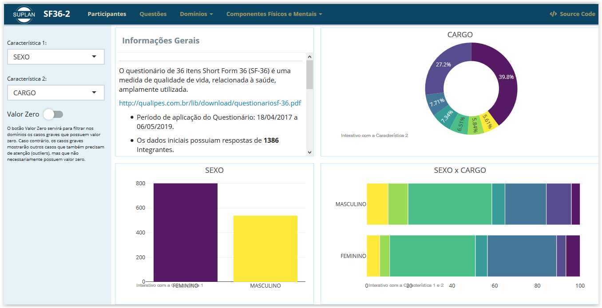

# SF36

SF-36 is a set of generic, coherent, and easily administered quality-of-life measures. These measures rely upon patient self-reporting and are now widely utilized by managed care organizations . 
The version of the questionnaire used for the study was the Brazilian version.
[SF36](http://qualipes.com.br/lib/download/questionariosf-36.pdf)  

- Application Period: 18/04/2017 a 06/05/2019.

- It was applied to employees of Ministério Público de Goiás (MPGO), but it was not mandatory.

- The initial data had **1386** observations.

- After remove missing values, the final data had **1336** observations. 

- **ATENTION!** The data can not be used to generalized the results to the others MPGO employees , because the sample is not probabilistic.

The features taken into consideration in this study were:

- SEX (SEXO);
- AGE (IDADE);
- POSITION (CARGO)
- CAPITAL/INTERIOR
- ÁREA MEIO/ ÁREA FIM
- LEVEL (NÍVEL)
- YEARS WORKING IN MP (ANOS NO MP)

)